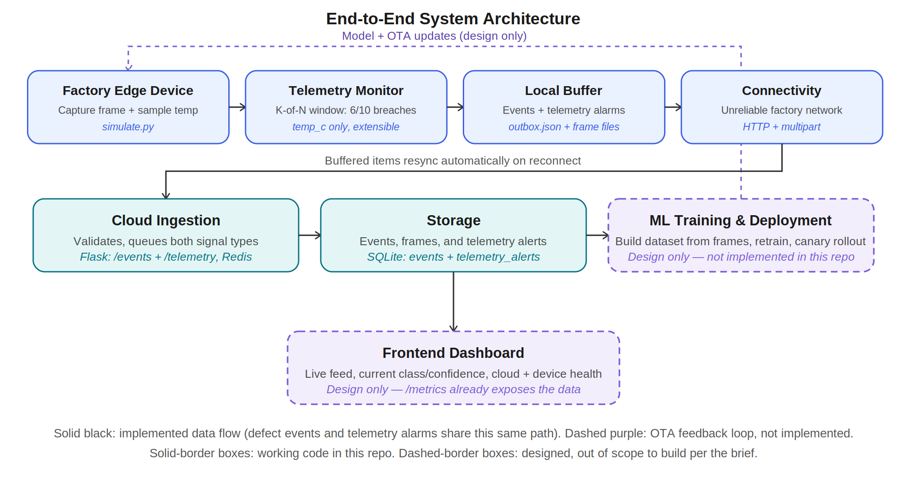

# NexTex AI — Take-Home Assignment

Cloud ingestion service (Part 1) + edge simulator (Part 2) for the Jetson
anomaly-detection pipeline, plus design notes (Part 3).

## Repo structure

```
nextex_take_home/
├── docker-compose.yml
├── architecture_diagram.png
├── cloud/
│   ├── Dockerfile
│   ├── api.py          # Flask app: POST /events, POST /telemetry, GET /frames/<file>, GET /metrics
│   ├── consumer.py      # drains events_queue + telemetry_queue into SQLite
│   ├── requirements.txt
│   └── data/            # SQLite file + uploaded frames live here (Docker volume)
└── simulator/
    ├── simulate.py       # stands in for a Jetson device
    └── requirements.txt
```

`captured_frames/` and `outbox.json` appear at runtime next to
`simulate.py` — both are gitignored, since they're the simulator's local
scratch space, not repo content.

## Running it

```
docker compose up --build
```

This starts three containers: Redis (queue), the ingestion API (`:8000`),
and the consumer that drains the queue into SQLite. `api.py` and
`consumer.py` read `REDIS_HOST` and `DB_PATH` from the environment (set
in `docker-compose.yml`), so the same code runs unmodified whether it's
in a container or on your machine.

In a separate terminal, run the edge simulator:

```
pip install -r simulator/requirements.txt
python simulator/simulate.py
```

Check the pipeline is working:

```
curl http://localhost:8000/metrics
```

### Restart policy

All three services declare `restart: unless-stopped`, confirmed
correctly applied to the running containers via `docker inspect`
(`HostConfig.RestartPolicy.Name: unless-stopped`). Automatic
restart-on-crash was tested directly — `docker compose kill consumer`,
then `docker events` and `docker inspect ... .State` — and did not fire
on this machine's Docker Desktop instance (`"Restarting":false`, no
subsequent `start` event), despite the policy being correctly set. This
looks like a local Docker Desktop daemon issue rather than a
configuration problem — the policy is correctly declared and applied —
but it's noted here rather than silently assumed to work. Worth
re-verifying on a different Docker environment before relying on it.

Separately confirmed: even without automatic restart, no data is lost
while `consumer` is down — Redis holds the full backlog (`backlog: 15`
observed in `/metrics`) until a consumer resumes reading, at which point
it drains completely (`backlog: 0`) with all events and their frames
intact. Manually restarting the container (`docker compose start
consumer`) was sufficient to trigger a full catch-up. The
automatic-restart gap above affects *recovery time*, not data integrity
— the queue itself is the safety net regardless of whether the consumer
comes back on its own or via manual intervention.

## What each part does

- **`cloud/api.py` → `POST /events`** — accepts either plain JSON or
  `multipart/form-data` (when a frame is attached). Validates that
  `event_type` and `confidence` are present, saves any attached frame to
  disk under `FRAMES_DIR`, then pushes the event (with a `frame_path` if
  applicable) onto a Redis list (`events_queue`) and returns `202`. It
  never touches SQLite directly — ingestion and processing are two
  separate concerns.
- **`cloud/api.py` → `POST /telemetry`** — accepts a telemetry
  alarm/resolved event (not raw per-reading data — see "Telemetry"
  below for why), validates `device_id`, `metric`, `value`, and `status`
  are present, pushes it onto a separate `telemetry_queue`, returns
  `202`. Kept as its own endpoint and queue rather than folded into
  `/events`, since it's a structurally different kind of signal (device
  health vs. product defects).
- **`cloud/api.py` → `GET /frames/<filename>`** — serves a previously
  uploaded frame back out. Exists so a retraining job (or a future
  dashboard) can actually retrieve what was captured, not just store it.
- **`cloud/api.py` → `GET /metrics`** — reports `total_events`,
  `backlog` (combined length of both queues), `events_by_type`
  (`new_class` vs `alarm`), `alarms_by_class` (which defects trigger
  alarms most often), `frames_captured`, `telemetry_alerts_total`, and
  `telemetry_by_metric` (alarm/resolved counts per monitored signal).
- **`cloud/consumer.py`** — a single process, `BLPOP`-ing on *both*
  `events_queue` and `telemetry_queue` at once (Redis returns whichever
  has data first), routing each item into the `events` table or the
  `telemetry_alerts` table based on which queue it came from. One
  process serving two queues rather than two separate consumers, since
  the volume here doesn't justify splitting them.
- **`simulator/simulate.py`** — every loop iteration does two things:
  defect detection and telemetry sampling. For defects: captures one
  frame first (`capture_frame()`: a small randomly-generated placeholder
  image — dummy images are explicitly fine per the brief), *then* runs
  `mock_inference()` against it to get a class + confidence — this
  ordering is deliberate, since a real device captures continuously and
  only finds out afterward whether a frame was interesting. The brief's
  two trigger rules decide the event type: first time seeing a class →
  `new_class`; confidence ≥ `CONFIDENCE_THRESHOLD` (0.85) → `alarm`.
  Every event that actually gets sent carries its frame; frames that
  never lead to a sent event are deleted immediately. For telemetry: see
  the dedicated "Telemetry" section below. Both defect events and
  telemetry alarms share the same buffering mechanism — if the API is
  unreachable, the item (event or telemetry alarm) is appended to a
  local `outbox.json` instead of being dropped, tagged with which
  endpoint it belongs to; every loop iteration calls `flush_outbox()`
  first, retrying anything still buffered before generating new data. A
  frame is only deleted locally once its event is confirmed received
  (`202`) — during an outage the file sits untouched in
  `captured_frames/`, available for the retry.

## Telemetry: windowed anomaly detection

The idea behind this feature: a single noisy telemetry reading shouldn't
raise an alarm on its own — a real device's temperature sensor can spike
for a second for all kinds of harmless reasons, and alerting on every
spike would make the alarm channel useless through noise. Instead,
`simulate.py` keeps a **sliding window of the last 10 readings per
metric**, and only raises an alarm if **at least 6 of those 10**
individually breached the metric's threshold (a K-of-N / debounce rule
— the same pattern real monitoring tools like Prometheus use: "alert if
X has been true for the last N minutes," not "alert the instant X is
true once").

The alarm is **edge-triggered**, not level-triggered: it fires once on
the transition into breach (`status: "alarm"`) and once on the
transition back out (`status: "resolved"`), not on every tick while the
problem persists — otherwise a sustained issue would resend the same
alarm dozens of times. Telemetry alarms reuse the exact same
outbox/retry mechanism as defect events (see above), so they survive a
cloud outage the same way — a temperature alarm that fails to send gets
buffered and retried, not dropped.

**Only `temp_c` is monitored for now**, to keep the windowing behavior
easy to demonstrate and verify. Extending to additional signals
(`cpu_load`, `gpu_load`, `disk_free_pct`) is a one-line addition to the
`TELEMETRY_METRICS` dict in `simulate.py` — `api.py` and `consumer.py`
are already metric-agnostic (they group and store by whatever `metric`
name arrives in the payload), so nothing on the cloud side needs to
change to add more signals.

**Verified**: since random noise alone is unlikely to produce 6-of-10
breaches within a short test run, a deterministic stress window is built
in (`temp_c` is forced high for ticks 15–24), guaranteeing the alarm
fires at least once per run rather than depending on luck. A captured
run shows exactly the intended behavior — one alarm, one resolution,
nothing repeated in between despite temperature staying elevated across
multiple ticks in that window, and no alarms anywhere else in the run
despite isolated single-reading spikes happening under the hood (by
design, a 10% per-tick chance of one noisy reading that should be
absorbed by the window):

```
Telemetry alarm: temp_c=93.1C (6/10 readings breached threshold)
...
Telemetry resolved: temp_c=52.7C (5/10 readings breached threshold)
```

Confirmed landing correctly in storage (not just printed to console) via
`curl http://localhost:8000/metrics` — `telemetry_alerts_total` and
`telemetry_by_metric` both reflect the alarm/resolved pair.

### What's *not* implemented: full telemetry transport

The K-of-N alarm above only ships a small, rare *derived* event to the
cloud (a state change), not the continuous raw readings themselves —
that's a deliberate scope decision, and the transport question for the
raw stream is still design-only, not built:

Telemetry (CPU/GPU/temp/sensor readings) differs from alarms and frames
in two ways that argue for different handling than what's built above.
Value density is much lower — one confidence alarm is actionable on its
own, one raw CPU-temperature reading generally isn't. And volume is much
higher and constant, not event-triggered, unlike the rare windowed
alarm. Given that, for the *raw* stream I'd go **hybrid**:
full-resolution telemetry stays on local disk (a rolling window,
overwritten as it fills), and only a downsampled summary ships to the
cloud on a slow interval, over MQTT rather than a synchronous HTTP POST
per reading — built for exactly this "many small messages, unreliable
network" case. Deep debugging on a specific device could pull the full
local log directly from it. The windowed alarm mechanism above and this
raw-stream question are complementary, not redundant: the alarm tells
you *something is wrong right now*, the raw stream (if built) would let
you investigate *why*, after the fact.

## Verified: zero-loss outage recovery, including frames

Tested against the actual dockerized service, with frames in the mix —
not just event metadata:

```
docker compose stop api        # kill the cloud mid-run
# simulator keeps running: events buffer into outbox.json,
# their frames stay in captured_frames/ (not deleted, since not yet confirmed)
docker compose start api       # bring it back
# next loop iterations resync the full outbox automatically;
# captured_frames/ empties out as each frame's event is confirmed
curl http://localhost:8000/metrics   # totals include everything, buffered or not
```

Captured run — 19 events sent normally (each carrying a frame), `api`
stopped mid-run (6 more events + frames buffered locally, visible sitting
in `captured_frames/` while down), `api` restarted, full backlog
resynced with zero loss, `captured_frames/` empties out immediately
after:

```
Sent event: {'device_id': 'jetson-01', 'class': 'vertical_lines', 'confidence': 0.89, 'event_type': 'new_class', '_frame_path': 'captured_frames/frame_8d8d87303b134ec28cdc30562593591a.jpg'}, Response: 202
Sent event: {'device_id': 'jetson-01', 'class': 'broken_stitch', 'confidence': 0.99, 'event_type': 'new_class', '_frame_path': 'captured_frames/frame_7deab407708e464aa3e4bd9466e640c0.jpg'}, Response: 202
Sent event: {'device_id': 'jetson-01', 'class': 'pinched_fabric', 'confidence': 0.92, 'event_type': 'new_class', '_frame_path': 'captured_frames/frame_d7c4cfb3d8f6475cb1a4c75c840a05a1.jpg'}, Response: 202
Sent event: {'device_id': 'jetson-01', 'class': 'vertical_lines', 'confidence': 0.95, 'event_type': 'alarm', '_frame_path': 'captured_frames/frame_6f145dd5caf14fdbb1feb9df9bfa5234.jpg'}, Response: 202
Sent event: {'device_id': 'jetson-01', 'class': 'oil_stain', 'confidence': 0.78, 'event_type': 'new_class', '_frame_path': 'captured_frames/frame_c1f03a4d0b2f4142a0e8172a1a4db71d.jpg'}, Response: 202
Sent event: {'device_id': 'jetson-01', 'class': 'needle_mark', 'confidence': 1.0, 'event_type': 'new_class', '_frame_path': 'captured_frames/frame_7193f85cb20245588d193c62541b819a.jpg'}, Response: 202
Sent event: {'device_id': 'jetson-01', 'class': 'broken_stitch', 'confidence': 0.99, 'event_type': 'alarm', '_frame_path': 'captured_frames/frame_69a69ceaeb3b49679ae8c521dd206243.jpg'}, Response: 202
Sent event: {'device_id': 'jetson-01', 'class': 'vertical_lines', 'confidence': 0.95, 'event_type': 'alarm', '_frame_path': 'captured_frames/frame_dd2672c4b92e448eb430ae0e23c4ad75.jpg'}, Response: 202
Sent event: {'device_id': 'jetson-01', 'class': 'pinched_fabric', 'confidence': 1.0, 'event_type': 'alarm', '_frame_path': 'captured_frames/frame_119e51024bfc4417a1e226acf0a53cd3.jpg'}, Response: 202
Sent event: {'device_id': 'jetson-01', 'class': 'pinched_fabric', 'confidence': 0.87, 'event_type': 'alarm', '_frame_path': 'captured_frames/frame_1c62867ecfe747c6bba9b4d0ec206c43.jpg'}, Response: 202
Sent event: {'device_id': 'jetson-01', 'class': 'pinched_fabric', 'confidence': 0.96, 'event_type': 'alarm', '_frame_path': 'captured_frames/frame_16e7ebee16864f3aa3cadbfe0a22b0eb.jpg'}, Response: 202
Sent event: {'device_id': 'jetson-01', 'class': 'vertical_lines', 'confidence': 0.92, 'event_type': 'alarm', '_frame_path': 'captured_frames/frame_4c8ed294657e42b1bc09a651a8f2c140.jpg'}, Response: 202
Sent event: {'device_id': 'jetson-01', 'class': 'pinched_fabric', 'confidence': 0.94, 'event_type': 'alarm', '_frame_path': 'captured_frames/frame_fa318ef7661b41d9981d9f64b8403d5d.jpg'}, Response: 202
Sent event: {'device_id': 'jetson-01', 'class': 'oil_stain', 'confidence': 0.91, 'event_type': 'alarm', '_frame_path': 'captured_frames/frame_c982ec4b7b174d299a189af003876945.jpg'}, Response: 202
Sent event: {'device_id': 'jetson-01', 'class': 'vertical_lines', 'confidence': 0.85, 'event_type': 'alarm', '_frame_path': 'captured_frames/frame_4ed693bd346f41c094a8b3abc078f015.jpg'}, Response: 202
Sent event: {'device_id': 'jetson-01', 'class': 'vertical_lines', 'confidence': 0.91, 'event_type': 'alarm', '_frame_path': 'captured_frames/frame_bda30073dec3487ab8de22dfc9e4b3c1.jpg'}, Response: 202
Sent event: {'device_id': 'jetson-01', 'class': 'needle_mark', 'confidence': 0.94, 'event_type': 'alarm', '_frame_path': 'captured_frames/frame_17833e3af1844cbfb47f4548bf367aec.jpg'}, Response: 202
Sent event: {'device_id': 'jetson-01', 'class': 'needle_mark', 'confidence': 0.98, 'event_type': 'alarm', '_frame_path': 'captured_frames/frame_9044ed2c93fe44a3b07301d607ed5528.jpg'}, Response: 202
Sent event: {'device_id': 'jetson-01', 'class': 'needle_mark', 'confidence': 0.86, 'event_type': 'alarm', '_frame_path': 'captured_frames/frame_352a98b6c72f46c787ff3d889f194ca1.jpg'}, Response: 202
Failed to send event: {'device_id': 'jetson-01', 'class': 'vertical_lines', 'confidence': 0.94, 'event_type': 'alarm', '_frame_path': 'captured_frames/frame_78547d4afda24d86ac6a0aa4be91eb16.jpg'}
Failed to send event: {'device_id': 'jetson-01', 'class': 'pinched_fabric', 'confidence': 0.9, 'event_type': 'alarm', '_frame_path': 'captured_frames/frame_23c46690badc45aa953e4f7bbc71025d.jpg'}
Failed to send event: {'device_id': 'jetson-01', 'class': 'needle_mark', 'confidence': 0.89, 'event_type': 'alarm', '_frame_path': 'captured_frames/frame_6398a41ebe64438681d1e7a0e438d699.jpg'}
Failed to send event: {'device_id': 'jetson-01', 'class': 'needle_mark', 'confidence': 0.88, 'event_type': 'alarm', '_frame_path': 'captured_frames/frame_f9cd1ebfaa7548ff913d32e5bd8daaac.jpg'}
Failed to send event: {'device_id': 'jetson-01', 'class': 'vertical_lines', 'confidence': 0.91, 'event_type': 'alarm', '_frame_path': 'captured_frames/frame_40d62fb87919438391dd98b7b42be107.jpg'}
Failed to send event: {'device_id': 'jetson-01', 'class': 'oil_stain', 'confidence': 0.87, 'event_type': 'alarm', '_frame_path': 'captured_frames/frame_d44e6812d8b4454781845df3b69da1fd.jpg'}
Resynced 6 events from outbox, 0 events remain in outbox.
Sent event: {'device_id': 'jetson-01', 'class': 'vertical_lines', 'confidence': 1.0, 'event_type': 'alarm', '_frame_path': 'captured_frames/frame_ffed98faa7d5462e9d32568bd3b027ae.jpg'}, Response: 202
Sent event: {'device_id': 'jetson-01', 'class': 'needle_mark', 'confidence': 0.91, 'event_type': 'alarm', '_frame_path': 'captured_frames/frame_54b7920d05bf4d679661738ef6f25e8d.jpg'}, Response: 202
```

Verified after this run: every buffered event's frame was still present
in `cloud/data/frames/`, and `GET /frames/<filename>` served each one
back successfully.

*(This log predates the telemetry feature — the outbox has since been
generalized to hold both event and telemetry items, so a fresh run's
resync message now reads "Resynced N item(s)" rather than "N events."
The mechanism and guarantee are identical; see the "Telemetry" section
above for telemetry specifically surviving an outage.)*

## Final validation pass

Beyond the outage test above, a full clean-slate protocol was run once
everything (frames, cleanup, restart policy) was in place, to catch
anything that only worked because of leftover state from earlier
testing:

1. **Full reset** — `docker compose down -v`, removed `events.db`,
   `outbox.json`, and everything under `cloud/data/frames/` and
   `captured_frames/`, then rebuilt from scratch.
2. **Baseline check** — `/metrics` on a freshly built, simulator-free
   stack returned all zeros, confirming no stale state survived the reset.
3. **Normal operation** — ran the simulator for ~40s; confirmed a mix of
   `new_class`/`alarm` events, `captured_frames/` staying empty between
   sends (cleanup firing immediately on success), and `frames_captured`
   in `/metrics` tracking `total_events` closely.
4. **Data integrity spot check** — queried recent rows directly in
   SQLite, confirmed `frame_path` populated, and retrieved one frame via
   `GET /frames/<filename>` to confirm it opens as a real image, not a
   truncated or corrupted file.
5. **Outage + resync with frames** — see the captured log above.
6. **Crash resilience** — `docker compose kill consumer` to simulate an
   actual crash rather than a graceful stop; see "Restart policy" above
   for the result (policy correctly configured, restart itself
   inconclusive on this machine's Docker Desktop).
7. **Final consistency check** — after all of the above, `/metrics`
   showed `backlog: 0` and internally consistent totals across
   `events_by_type`, `alarms_by_class`, and `frames_captured`.
8. **Telemetry windowing** — ran a fresh simulator session through the
   deterministic stress window (ticks 15–24); confirmed exactly one
   `alarm` and one `resolved` transition printed and stored, no spurious
   alarms elsewhere in the run despite isolated random spikes occurring,
   and `/metrics` reflecting both entries under `telemetry_by_metric`.

## Architecture & design choices



The system follows the chain factory edge devices → connectivity → cloud
backend services → storage → ML training/deployment loop → frontend.
Solid-border boxes in the diagram are implemented and tested in this
repo; dashed-border boxes (the training/deployment loop and the
frontend) are designed but explicitly out of scope as working code per
the assignment.

On the device side, the edge captures a frame every cycle and runs
(mocked) inference against it, buffering locally to `outbox.json`
whenever the cloud is unreachable — this is the piece proven end to end
in the outage tests above. Connectivity is treated as unreliable by
design rather than assumed away: nothing on the device side depends on
the network being up at any given moment. On the cloud side, ingestion
deliberately decouples *receiving* an event from *processing* it — the
API's only job is to validate and enqueue, and a separate consumer
process drains the queue into storage — so a slow or crashed consumer
can never block a device from successfully reporting an event. Storage
splits structured event data from frame blobs rather than mixing them,
since they have very different access patterns (frequent small queries
vs. occasional large reads). The training loop and frontend are drawn to
show where this pipeline would connect to next — a retraining job
pulling frames via `GET /frames/<filename>`, and a dashboard reading the
same `/metrics` endpoint already built — without having built either,
since the brief marks both as optional.

The specific technology choices within that architecture:

**Redis for the queue.** Single binary, no config, `LPUSH`/`BRPOP` is
enough for the producer/consumer split the brief asks for. Kafka or
RabbitMQ would make more sense at real fleet scale but add setup cost
with no benefit at this size.

**SQLite for storage.** A file-based DB removes any need to provision a
database service for a take-home. `api.py` and `consumer.py` share the
same file via the `./cloud/data` Docker volume.

**One generic `events` table, not one per defect type.** The brief's
appendix makes this explicit: alarms and new-class detections reach the
backend as the same shape (a class label + confidence), and the defect
vocabulary is expected to keep growing — special-casing types in the
schema would mean a migration every time a new defect is added.

**`event_type` is strictly `new_class` / `alarm`; `class` is the defect
name.** These answer two different questions — *why* did this event
fire vs. *what* did the model see — and conflating them into one field
would make it impossible to answer either cleanly. `/metrics` reports
both breakdowns separately.

**Frames are attached to every sent event, not just `new_class`.** The
brief's literal wording ties frame upload to new-class detections only,
reasoned around bandwidth (new classes are rare; alarms are frequent).
But an alarm with no visual evidence isn't very actionable — the whole
point of a human-in-the-loop check is being able to look at what
triggered it and judge real defect vs. noise/bad-frame/model error. I
chose to attach the frame to any event that actually leaves the device
(new-class *or* alarm), and I'm treating this as a deliberate deviation
from the literal brief rather than an oversight, since the assignment
explicitly invites changing something you think could be done better
and explaining why. The bandwidth trade-off this reintroduces is called
out below under scaling.

**Capture happens before inference, every loop tick, unconditionally.**
Earlier iterations of the simulator picked a defect class first and then
fetched a matching template image — backwards from how a real pipeline
works, where the camera captures continuously and the model only
afterward decides whether a given frame was interesting. Frames that
don't lead to a sent event are deleted immediately rather than kept, to
avoid a real device accumulating captures with no purpose.

**Telemetry alarms use a separate endpoint and queue from defect
events, but share the consumer process.** `/telemetry` and
`telemetry_queue` are kept distinct from `/events` and `events_queue`
because they're structurally different signals (device health vs.
product defects, windowed-and-rare vs. per-frame). But a single
`consumer.py` process drains both via `BLPOP` on two keys rather than
running two separate consumer processes, since the current volume
doesn't justify the added operational complexity of two things to
deploy, monitor, and restart independently. Full reasoning on the
windowing approach itself is in the "Telemetry" section above.

## What breaks going from 1 factory / 1 device to 50 factories / 20 devices each

That's 1 → 1,000 devices. A few things stop being fine:

- **SQLite stops being viable** — a single file with limited concurrent-write
  support, fine for one API + one consumer, not fine for 1,000 devices'
  continuous write volume. First thing I'd swap, for Postgres.
- **Redis as a single list is a bottleneck and a single point of failure**
  — I'd move to something with partitioning and consumer groups (Kafka)
  so throughput scales with the number of consumers.
- **One consumer process can't keep up** — needs to become horizontally
  scalable, or backlog grows unbounded during any traffic spike. This
  applies to the combined `events_queue` + `telemetry_queue` consumer
  too — at fleet scale I'd likely split them back into separate
  consumers so a telemetry backlog can't delay defect-event processing.
- **Frames on every alarm gets expensive at fleet scale.** Attaching a
  full frame to every alarm (not just new-class) is fine for one
  simulated device; at 1,000 devices it's a real bandwidth and storage
  cost. I'd likely make this conditional in production — e.g. only the
  first N alarms per class per device per day carry a full frame, or a
  low-res thumbnail ships by default with the full-resolution original
  pulled on demand only when a human actually opens that specific alarm.
- **Local frame storage on disk (`cloud/data/frames/`) doesn't scale
  past one machine** — production needs real object storage (S3 or
  equivalent), not a Docker volume on a single host.
- **Device identity becomes a real problem** — right now `device_id` is
  a hardcoded string anyone could send; at 1,000 devices you need real
  per-device credentials so one compromised device can't impersonate
  another.
- **`/metrics` as written won't hold up** — it's a full-table-scan count
  query on every request; at that volume you'd want counters updated
  incrementally as events land instead.

## What I'd address before production

- **Networking.** Every component here addresses the others via
  `localhost` or Docker service names (`redis`, `api`), which only
  resolve within one machine or one Docker network — appropriate for a
  local take-home (the brief explicitly asks for `docker compose up`,
  not a cloud deployment) but not something that carries over as-is.
  Production needs a real DNS domain for the ingestion API behind a load
  balancer, HTTPS instead of plain HTTP, and the device's `BASE_URL`
  moved from a hardcoded string into device-provisioned configuration.
  Redis and the database would sit in a private network, never exposed
  publicly the way they are on `localhost` today.
- **Device identity and security** — anything can currently `POST` to
  `/events` or `/telemetry` claiming any `device_id`; production needs
  per-device certificates (mutual TLS) so the ingestion service can
  verify a device before trusting its data.
- **Observability** — `/metrics` here is pull-based and manual.
  Production needs structured logging/metrics from both the API and
  consumer, plus alerting on backlog growth specifically, since a
  growing queue backlog is exactly the signal that something's unhealthy
  — including a telemetry-specific backlog, so a device-health problem
  doesn't quietly go unnoticed behind a healthy-looking overall metric.
- **OTA updates** — out of scope to build, but I'd design toward:
  versioned model artifacts in a registry, staged/canary rollout before
  fleet-wide push, and a rollback path.
- **Data lifecycle** — uploaded frames need a retention policy; keeping
  every frame forever is a cost and privacy problem at fleet scale.

## Assumptions

- A "new anomaly class" always fires its own event even if its
  confidence also crosses the alarm threshold (new-class-or-alarm, not
  both at once) — an explicit interpretation call, since the brief
  doesn't specify what happens when both conditions are true.
- Captured frames are randomly generated placeholder images (a colored
  background with a few random shapes), not real fabric photos — the
  brief explicitly says dummy images are fine, and since inference is
  fully mocked, pixel content doesn't affect the behavior being
  demonstrated (upload, storage, retrieval, buffering, cleanup).
- `seen_classes` in `simulate.py` is in-memory only, so a simulator
  restart re-reports already-seen classes as new. A real device would
  persist this locally so a reboot doesn't retrigger new-class events —
  noted as a known simplification given the time budget, not fixed.
- Telemetry alarm detection is implemented for `temp_c` only, with the
  K-of-N window and thresholds as constants in `simulate.py` rather than
  device-configurable — a real fleet would likely need per-device or
  per-deployment-environment thresholds (a factory floor runs hotter
  than a lab). Extending to more signals is straightforward (see
  "Telemetry" above); making thresholds configurable per device was not,
  given the time budget.
- Continuous raw telemetry transport (as opposed to the derived
  alarm/resolved events, which are implemented) remains design-only —
  see "What's not implemented: full telemetry transport" above.
- The Docker restart policy is declared and confirmed applied to all
  three services, but automatic restart-on-crash itself could not be
  confirmed working on the development machine's Docker Desktop
  instance — see "Restart policy" above for the specific evidence.
